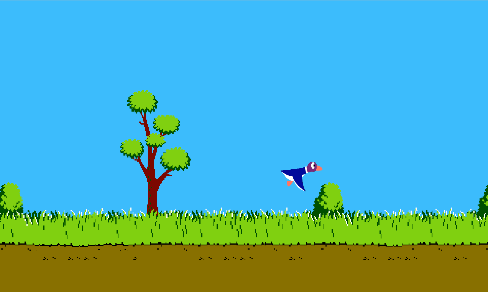

# my_hunter
A graphical project with CSFML to recreate the famous Duck Hunt game. 



<!-- ABOUT THE PROJECT -->
## About the project
The goal of the game is to kill as many birds as possible. For this you just have to left-click on the birds. You have the right to miss 5 shots. Every time you hit the bird, the score increases by 100

<!-- REQUIREMENTS -->
## Requirements
* GCC

<!-- GETTING STARTED -->
## Getting Started
Execute ```make``` then ```./my_hunter``` 
